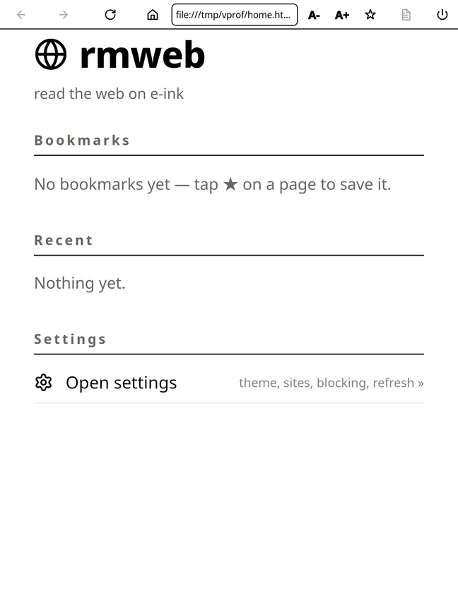
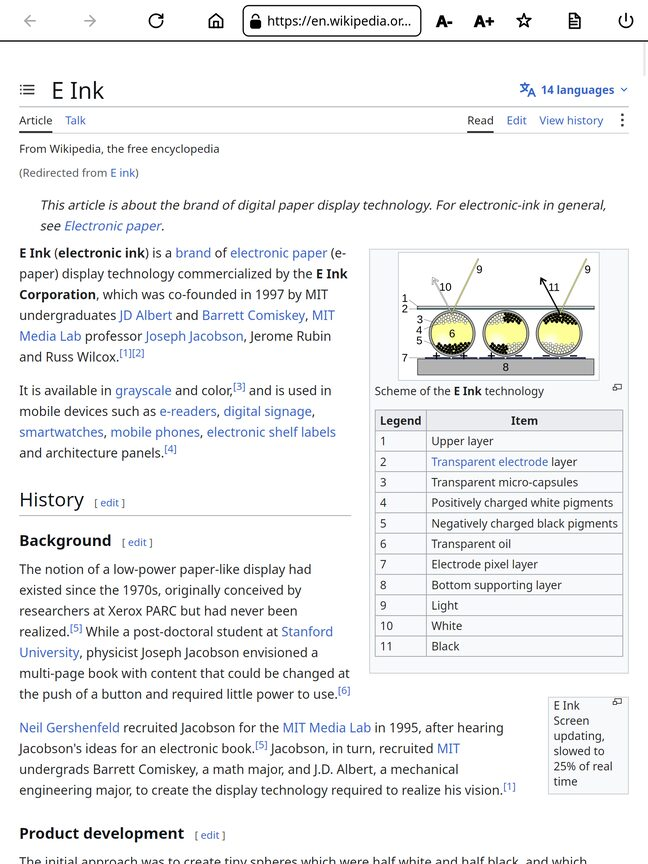
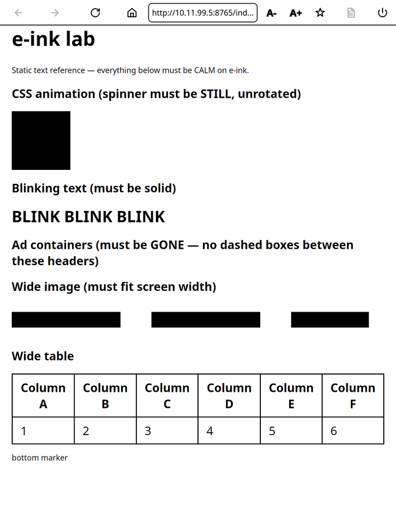
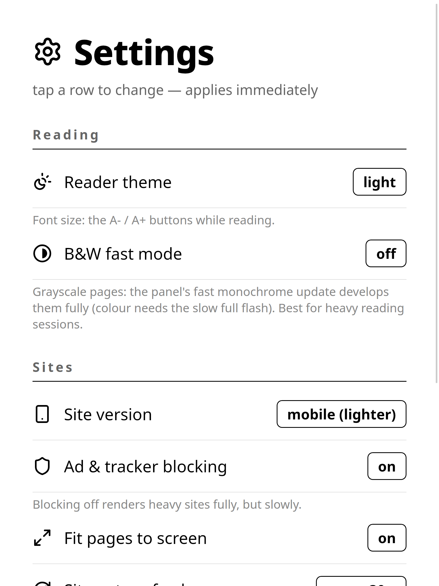

# rmweb

A native **WPE WebKit** web browser for the **reMarkable Paper Pro** e-ink tablet.



> **Status: v0.9.0 — beta.** The primary use case is **reading**; general browsing is basic.
> Implemented and verified on-device: reader mode (Mozilla Readability, light/dark theme), B2 chrome
> painted into the frame (with C++ hit-test and inverted press feedback on every button and key),
> touch/pen input via evdev with a phantom-touch guard, on-screen URL keyboard, bookmarks/history/
> settings persisted in the profile dir, a redesigned HTML start page (`rmweb:` scheme) with letter
> avatars and a tabs-lite open-pages switcher, a **separate settings page** (tap-to-toggle rows,
> applies immediately), page/reader zoom, content blocking (WebKit UserContentManager filter) with
> **cosmetic rules that collapse blocked-ad containers** (no white holes), an e-ink **calm-down
> stylesheet** (kills CSS animations/transitions/smooth scrolling), an **auto-refresh guard** that
> throttles pages reloading themselves while you read, a loading pill with progress and a **stop
> button**, persistent cookies (sqlite — logins survive relaunch), per-URL scroll restore, in-page
> find (`/text` in the address bar), downloads to `~/Downloads`, form filling (tap a text field →
> on-screen keyboard with its current value, password masked; tap toggles checkbox/radio and cycles
> selects), learn-as-you-type autofill for email/username/name fields (passwords are never
> learned), a per-host password store (obfuscated — NOT encrypted), styled error pages with Retry,
> a TLS padlock, address-bar search over local bookmarks+history (with a web-search link),
> long-press link peek, a KOReader-style reading-progress bar, a coherent **Lucide icon set** drawn
> as vectors (crisp on e-ink, font-independent), a home-screen icon in the stock launcher (XOVI +
> AppLoad), and a no-brick launcher that stops/restores xochitl. E-ink-safe: CPU-only llvmpipe +
> Skia, ~120–250 ms page turns, low RAM.
> A 2026-07-18 code review ([docs/review-2026-07-18.md](docs/review-2026-07-18.md)) found open
> security/robustness issues; the HIGH/CRITICAL items were fixed after it (see git log), but treat
> this as enthusiast-grade beta software, not a hardened product.

## Screenshots

| | | |
|---|---|---|
|  |  |  |
| Wikipedia | e-ink lab | Settings page |

More: [loading pill with stop button](docs/screenshots/loading-badge.png) ·
[e-ink lab: animations frozen, ad slots collapsed, wide media fit](docs/screenshots/eink-lab.png)

## Why it's interesting

The Paper Pro's i.MX8M Mini SoC actually has a GPU on die (Vivante GC7000 UltraLite), but the
stock OS ships no driver for it (no `/dev/dri` render node) — so in practice everything renders
on the CPU. rmweb renders the web entirely in software — **Skia CPU raster + Mesa llvmpipe
(software EGL)** — and presents through reMarkable's e-ink display path.

## Architecture (short)

```
input (touch/pen) → shell (Qt6/QML chrome) → engine (WPE, software GL)
        ARGB8888 frame → display (Qt6 + epaper QPA) → imx-drm → E-Ink 1620×2160
```

Five isolated modules: `engine`, `display`, `input`, `shell`, `platform`.
Full design: [`docs/superpowers/specs/2026-06-24-rmweb-browser-design.md`](docs/superpowers/specs/2026-06-24-rmweb-browser-design.md).
Verified hardware facts: [`docs/device-profile.md`](docs/device-profile.md).

## Target device

reMarkable Paper Pro ("Ferrari"), Codex Linux (scarthgap), aarch64, kernel 6.12.49. GPU exists on
the SoC but has no driver in the stock OS, so rendering is **CPU-only**.
Everything installs under `/home/root/rmweb` (the rootfs is full). Cross-compiled with the
official reMarkable "ferrari" Yocto SDK.

## Build & Install

```bash
./scripts/fetch-sdk.sh          # download Yocto SDK once
./scripts/build-wpeqt.sh        # build rmweb-wpeqt
./scripts/bundle.sh             # create device bundle
./scripts/run-wpeqt-on-device.sh show https://example.com
```

Full instructions: [`docs/install.md`](docs/install.md)

## Roadmap / Planned

Not implemented yet (earlier docs claimed some of these by mistake — see the review above):
on-device JS console, user/content scripts, performance dashboard.

## Credits & License

[MIT](LICENSE) — see the file for details. Third-party components (WPE WebKit, Qt6, Mesa,
Mozilla Readability, Lucide icons, XOVI/AppLoad) and their licenses are listed in
[NOTICE](NOTICE).

Co-developed with AI pair-programming — many thanks to **Claude Code** (Anthropic), **Grok** (xAI)
and **Kimi** (Moonshot AI), who wrote and reviewed large parts of this project.
